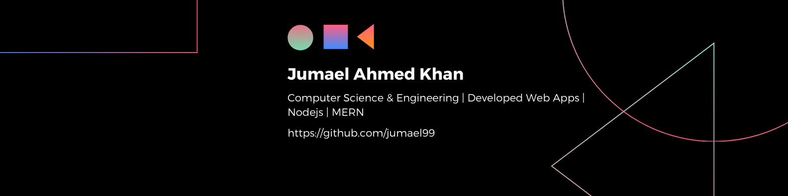

# Hello, This is Jumael Ahmed Khan

## Future Software Engineer 

I have a strong passion for tackling challenges that require creativity and innovative thinking love to work in backend. 

### Technologies I know:

### Programming Languages:

## Current Overview

## About Me

- 🎓 Pursuing CSE at IUBAT - International University of Business Agriculture and Technology
- 💻 Passionate about backend development, with a special love for Node.js
- 🚀 Currently expanding my skills with Next.js and NestJS
- 🌟 Eager to contribute to open-source projects and collaborate with fellow developers
- 💬 Always excited to discuss the latest in tech, especially backend technologies
- 🔍 Seeking opportunities to apply my skills in real-world backend projects

## GitHub Stats

  
More Stats

### Top Languages

### Top Languages

